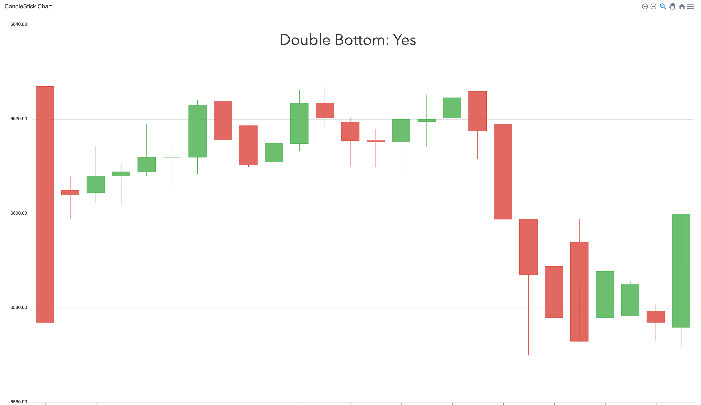
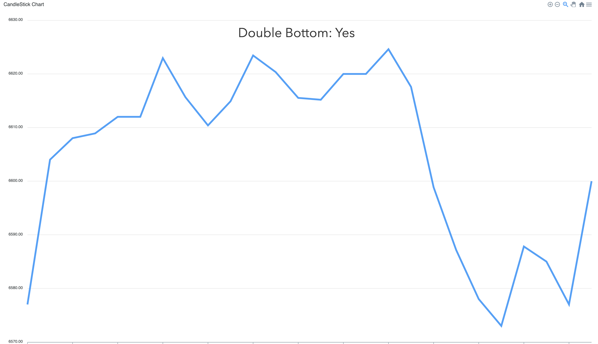
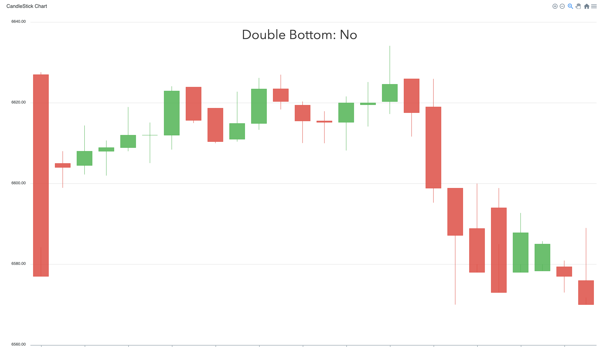
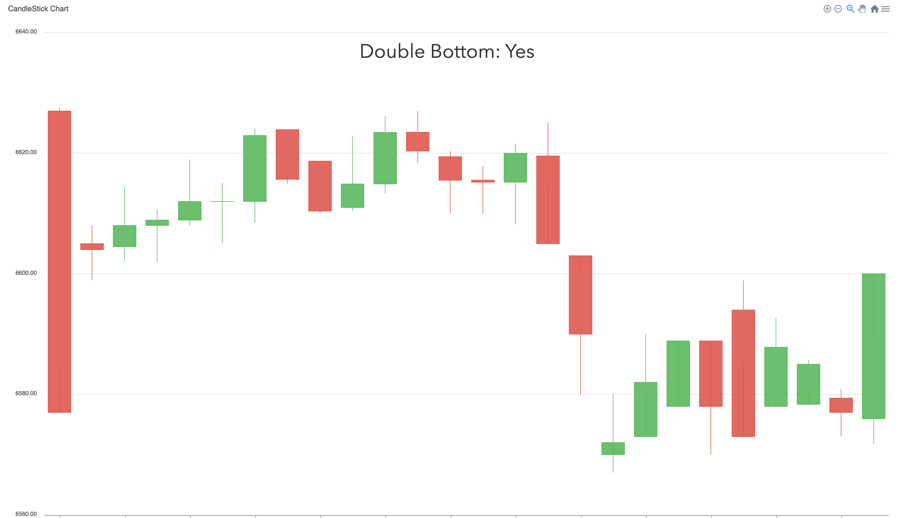
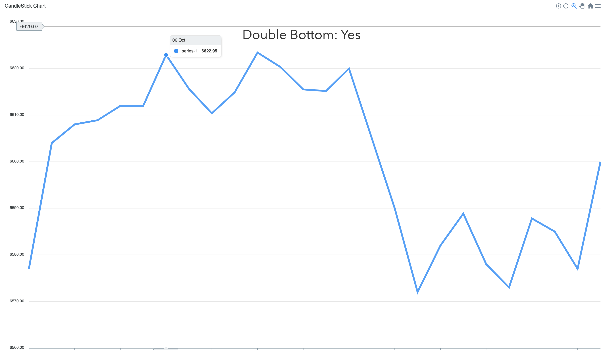
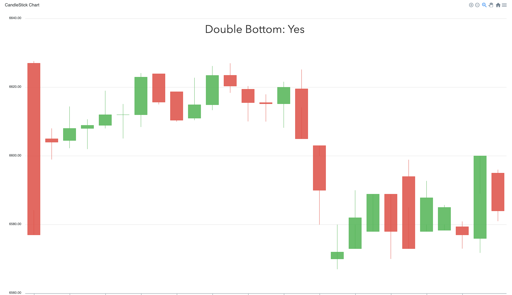
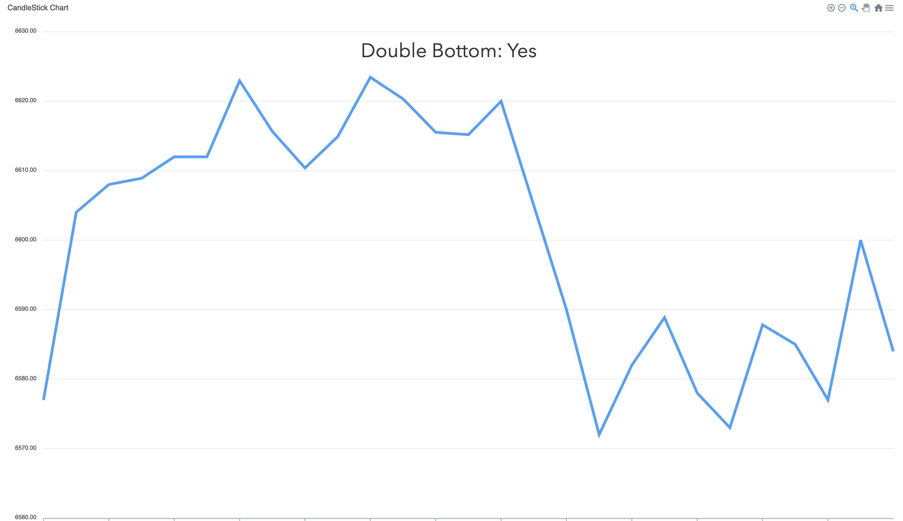

# Find Double Bottoms
### Can adjust to any length of range!

#### Double bottom with range of 5 points (candlestick)

#### Double bottom with range of 5 points (line)

#### No double bottom with range of 5 points (candlestick)

#### No double bottom with range of 5 points (line)

#### Double bottom with range of 9 points (candlestick)

#### Double bottom with range of 9 points (line)

### Even works for pullbacks!
#### Double bottom with range of 9 points (candlestick), with pullback

#### Double bottom with range of 9 points (line), with pullback

